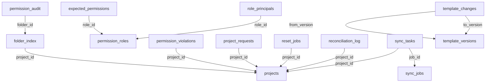

# RFP Database Schema Reference (rfp schema)
> **Source of Truth** — Extracted from live Supabase DB on 2026-02-13
> **All code MUST match this schema exactly**

---

## Critical Tables for Rebuild Index & Enforce

### `rfp.folder_index`
| # | Column | Type | Nullable | Default | Notes |
|---|--------|------|----------|---------|-------|
| 1 | `id` | uuid | NO | gen_random_uuid() | PK |
| 2 | `project_id` | uuid | NO | — | FK → projects.id (CASCADE) |
| 3 | `drive_folder_id` | text | NO | — | **UNIQUE** |
| 4 | `template_path` | text | NO | — | |
| 5 | `expected_limited_access` | boolean | NO | false | |
| 6 | `expected_groups` | jsonb | YES | '[]'::jsonb | |
| 7 | `expected_users` | jsonb | YES | '[]'::jsonb | |
| 8 | `actual_limited_access` | boolean | YES | — | |
| 9 | `last_verified_at` | timestamptz | YES | — | |
| 10 | `is_compliant` | boolean | YES | — | GENERATED (actual = expected) |
| 11 | `created_at` | timestamptz | YES | now() | |
| 12 | `updated_at` | timestamptz | YES | now() | |
| 13 | `normalized_template_path` | text | YES | — | |

> ⚠️ **`drive_folder_name` does NOT exist** — RPC `upsert_folder_index` references it but it's missing from the table

**Indexes:**
- `folder_index_pkey` — UNIQUE(id)
- `folder_index_drive_folder_id_key` — UNIQUE(drive_folder_id)
- `idx_folder_index_project` — (project_id)
- `idx_folder_index_template_path` — (template_path)
- `idx_folder_index_drive_folder` — (drive_folder_id)
- `idx_folder_index_noncompliant` — (is_compliant) WHERE is_compliant = false
- `idx_folder_index_unverified` — (last_verified_at NULLS FIRST)

---

### `rfp.projects`
| # | Column | Type | Nullable | Default | Notes |
|---|--------|------|----------|---------|-------|
| 1 | `id` | uuid | NO | gen_random_uuid() | PK |
| 2 | `pr_number` | text | NO | — | **UNIQUE** |
| 3 | `name` | text | NO | — | |
| 4 | `status` | text | YES | 'bidding' | |
| 5 | `drive_folder_id` | text | NO | — | |
| 6 | `rfp_folder_id` | text | YES | — | |
| 7 | `pd_folder_id` | text | YES | — | |
| 8 | `synced_version` | int4 | YES | 0 | |
| 9 | `last_synced_at` | timestamptz | YES | — | |
| 10 | `last_enforced_at` | timestamptz | YES | — | |
| 11 | `created_at` | timestamptz | YES | now() | |
| 12 | `phase` | text | YES | 'bidding' | CHECK: bidding or execution |

> **Note**: `get_projects` RPC returns these snake_case columns directly. `normalizeProject()` converts to camelCase.

---

### `rfp.sync_jobs`
| # | Column | Type | Nullable | Default |
|---|--------|------|----------|---------|
| 1 | `id` | uuid | NO | gen_random_uuid() |
| 2 | `job_type` | text | NO | — |
| 3 | `target_version` | int4 | YES | — |
| 4 | `status` | text | YES | 'pending' |
| 5 | `priority` | int4 | YES | 5 |
| 6 | `total_tasks` | int4 | YES | 0 |
| 7 | `completed_tasks` | int4 | YES | 0 |
| 8 | `failed_tasks` | int4 | YES | 0 |
| 9 | `progress_percent` | int4 | YES | 0 |
| 10 | `started_by` | text | YES | — |
| 11 | `started_at` | timestamptz | YES | — |
| 12 | `completed_at` | timestamptz | YES | — |
| 13 | `error_summary` | text | YES | — |
| 14 | `metadata` | jsonb | YES | — |
| 15 | `created_at` | timestamptz | YES | now() |

---

### `rfp.sync_tasks`
| # | Column | Type | Nullable | Default |
|---|--------|------|----------|---------|
| 1 | `id` | uuid | NO | gen_random_uuid() |
| 2 | `job_id` | uuid | NO | — |
| 3 | `project_id` | uuid | YES | — |
| 4 | `folder_index_id` | uuid | YES | — |
| 5 | `task_type` | text | NO | — |
| 6 | `task_details` | jsonb | NO | — |
| 7 | `status` | text | YES | 'pending' |
| 8 | `attempts` | int4 | YES | 0 |
| 9 | `max_attempts` | int4 | YES | 3 |
| 10 | `last_error` | text | YES | — |
| 11 | `created_at` | timestamptz | YES | now() |
| 12 | `started_at` | timestamptz | YES | — |
| 13 | `completed_at` | timestamptz | YES | — |

---

### `rfp.permission_audit`
| # | Column | Type | Nullable | Default | Notes |
|---|--------|------|----------|---------|-------|
| 1 | `id` | uuid | NO | gen_random_uuid() | PK |
| 2 | `folder_id` | uuid | YES | — | FK → folder_index.id (CASCADE) |
| 3 | `job_id` | uuid | YES | — | |
| 4 | `action` | text | NO | — | add/remove/enable_limited_access/etc |
| 5 | `principal_type` | text | YES | — | |
| 6 | `principal_email` | text | YES | — | |
| 7 | `principal_role` | text | YES | — | |
| 8 | `permission_id` | text | YES | — | |
| 9 | `is_inherited` | boolean | YES | false | |
| 10 | `inherited_from` | text | YES | — | |
| 11 | `before_state` | jsonb | YES | — | |
| 12 | `after_state` | jsonb | YES | — | |
| 13 | `result` | text | NO | — | |
| 14 | `error_message` | text | YES | — | |
| 15 | `created_at` | timestamptz | YES | now() | |

---

## Other Tables

### `rfp.permission_roles`
| Column | Type | Nullable | Notes |
|--------|------|----------|-------|
| `id` | uuid | NO | PK |
| `name` | text | NO | UNIQUE |
| `description` | text | YES | |
| `drive_role` | text | NO | |
| `is_system` | boolean | YES | default false |
| `created_at` | timestamptz | YES | |

### `rfp.role_principals`
| Column | Type | Nullable | Notes |
|--------|------|----------|-------|
| `id` | uuid | NO | PK |
| `role_id` | uuid | NO | FK → permission_roles.id (CASCADE) |
| `principal_type` | text | NO | |
| `principal_email` | text | NO | |
| `created_at` | timestamptz | YES | |

UNIQUE(role_id, principal_email)

### `rfp.expected_permissions`
| Column | Type | Nullable | Notes |
|--------|------|----------|-------|
| `id` | uuid | NO | PK |
| `template_path` | text | NO | |
| `role_id` | uuid | NO | FK → permission_roles.id |
| `created_at` | timestamptz | YES | |

UNIQUE(template_path, role_id)

### `rfp.reset_jobs`
| Column | Type | Nullable | Notes |
|--------|------|----------|-------|
| `id` | uuid | NO | PK |
| `project_id` | uuid | YES | FK → projects.id (CASCADE) |
| `folder_ids` | uuid[] | YES | default ARRAY[]::uuid[] |
| `total_folders` | int4 | NO | |
| `processed_folders` | int4 | YES | default 0 |
| `successful_folders` | int4 | YES | default 0 |
| `failed_folders` | int4 | YES | default 0 |
| `status` | text | NO | CHECK: pending/running/completed/failed/cancelled |
| `started_at` | timestamptz | YES | |
| `completed_at` | timestamptz | YES | |
| `created_at` | timestamptz | YES | |
| `created_by` | text | YES | |

### `rfp.folder_templates`
| Column | Type | Nullable |
|--------|------|----------|
| `id` | uuid | NO |
| `version_number` | int4 | NO |
| `template_json` | jsonb | NO |
| `created_at` | timestamptz | YES |
| `created_by` | text | YES |
| `is_active` | boolean | YES |
| `notes` | text | YES |

### `rfp.template_versions`
| Column | Type | Nullable |
|--------|------|----------|
| `id` | uuid | NO |
| `version_number` | int4 | NO (UNIQUE) |
| `template_json` | jsonb | NO |
| `created_by` | text | NO |
| `created_at` | timestamptz | YES |
| `is_active` | boolean | YES |

### `rfp.template_changes`
| Column | Type | Nullable |
|--------|------|----------|
| `id` | uuid | NO |
| `from_version` | int4 | YES (FK → template_versions) |
| `to_version` | int4 | NO (FK → template_versions) |
| `change_type` | text | NO |
| `affected_path` | text | NO |
| `change_details` | jsonb | NO |
| `created_at` | timestamptz | YES |

### `rfp.user_directory`
| Column | Type | Nullable |
|--------|------|----------|
| `id` | uuid | NO |
| `google_id` | text | YES (UNIQUE) |
| `email` | text | NO (UNIQUE) |
| `name` | text | YES |
| `given_name` | text | YES |
| `family_name` | text | YES |
| `photo_url` | text | YES |
| `department` | text | YES |
| `role` | text | YES (default 'User') |
| `status` | text | YES (default 'Active') |
| `last_login` | timestamptz | YES |
| `synced_at` | timestamptz | YES |
| `created_at` | timestamptz | YES |

### `rfp.group_directory`
| Column | Type | Nullable |
|--------|------|----------|
| `id` | uuid | NO |
| `google_id` | text | YES (UNIQUE) |
| `email` | text | NO (UNIQUE) |
| `name` | text | NO |
| `description` | text | YES |
| `member_count` | int4 | YES (default 0) |
| `mapped_role` | text | YES |
| `synced_at` | timestamptz | YES |
| `created_at` | timestamptz | YES |

### `rfp.user_group_membership`
| Column | Type | Nullable |
|--------|------|----------|
| `id` | uuid | NO |
| `user_email` | text | NO |
| `group_email` | text | NO |
| `added_at` | timestamptz | YES |
| `added_by` | text | YES |

UNIQUE(user_email, group_email)

### `rfp.user_tokens`
| Column | Type | Nullable |
|--------|------|----------|
| `id` | uuid | NO |
| `email` | text | NO (UNIQUE) |
| `access_token_encrypted` | text | NO |
| `refresh_token_encrypted` | text | NO |
| `token_expiry` | timestamptz | YES |
| `created_at` | timestamptz | YES |
| `updated_at` | timestamptz | YES |

### `rfp.app_settings`
| Column | Type | Nullable |
|--------|------|----------|
| `id` | uuid | NO |
| `key` | text | NO (UNIQUE) |
| `value` | jsonb | NO |
| `updated_by` | text | YES |
| `updated_at` | timestamptz | YES |

### `rfp.system_settings`
| Column | Type | Nullable |
|--------|------|----------|
| `id` | uuid | NO |
| `setting_key` | text | NO (UNIQUE) |
| `setting_value` | jsonb | NO |
| `description` | text | YES |
| `updated_at` | timestamptz | YES |
| `updated_by` | text | YES |

### `rfp.project_requests`
| Column | Type | Nullable |
|--------|------|----------|
| `id` | uuid | NO |
| `request_type` | text | NO (CHECK: new_project/upgrade_to_pd) |
| `project_name` | text | NO |
| `pr_number` | text | YES |
| `project_id` | uuid | YES (FK → projects.id CASCADE) |
| `status` | text | NO (CHECK: pending/approved/rejected) |
| `requested_by` | text | NO |
| `requested_at` | timestamptz | YES |
| `reviewed_by` | text | YES |
| `reviewed_at` | timestamptz | YES |
| `rejection_reason` | text | YES |
| `created_at` | timestamptz | YES |

### `rfp.permission_violations`
| Column | Type | Nullable |
|--------|------|----------|
| `id` | uuid | NO |
| `folder_index_id` | uuid | YES |
| `project_id` | uuid | YES (FK → projects.id) |
| `violation_type` | text | NO |
| `expected` | jsonb | YES |
| `actual` | jsonb | YES |
| `auto_reverted` | boolean | YES |
| `detected_at` | timestamptz | YES |
| `resolved_at` | timestamptz | YES |
| `resolved_by` | text | YES |

### `rfp.reconciliation_log`
| Column | Type | Nullable |
|--------|------|----------|
| `id` | uuid | NO |
| `folder_index_id` | uuid | YES |
| `project_id` | uuid | YES (FK → projects.id) |
| `issue_type` | text | NO |
| `expected_path` | text | YES |
| `expected_name` | text | YES |
| `actual_path` | text | YES |
| `actual_name` | text | YES |
| `resolution` | text | YES |
| `resolved_at` | timestamptz | YES |
| `detected_at` | timestamptz | YES |

### `rfp.audit_log`
| Column | Type | Nullable |
|--------|------|----------|
| `id` | uuid | NO |
| `action` | text | NO |
| `entity_type` | text | NO |
| `entity_id` | text | YES |
| `old_value` | jsonb | YES |
| `new_value` | jsonb | YES |
| `details` | jsonb | YES |
| `performed_by` | text | YES |
| `ip_address` | text | YES |
| `created_at` | timestamptz | YES |

---

## RLS Status
**All tables: RLS DISABLED** (relying on service_role key for access control)

---

## Foreign Key Relationships

